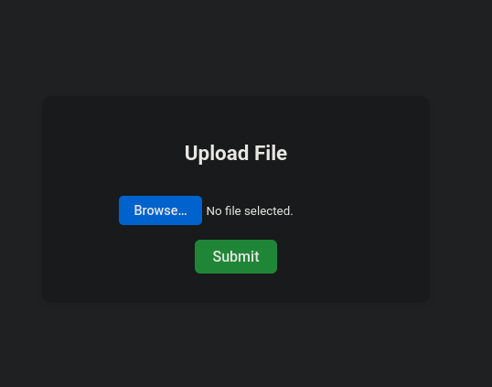

# Clare - util for file sharing with a web interface

I never had a good way to transfer files from a pc to another pc or a phone, \
so here is clare, simple web interface + go backend that you launch with one command. \
\
All you need is a host to run clare and a browser on the client side.

## Features

- upload files to host
- view/download files from host

## Example

- share pictures: `clare -r ~/Pictures -t`
- allow for video upload: `clare -r ~/Videos`

## Help

```
clare: cli util for file sharing

After running clare a web server will be started
with root as your current working directory.

Files uploaded from the web interface will be written
to the "root" directory (not /, but your working dir, or the path specified by -r flag).

You can change from reciver by -t flag or by visiting /t path in the web interface.

[OPTIONS]
-h          show this menu
-r [PATH]   change the root directory (the directory which you wish to share)
-t          change to transceiver (files will be available in the web interface)
-i          don't inverse the qr code, (white background will be present)
```

# Images




